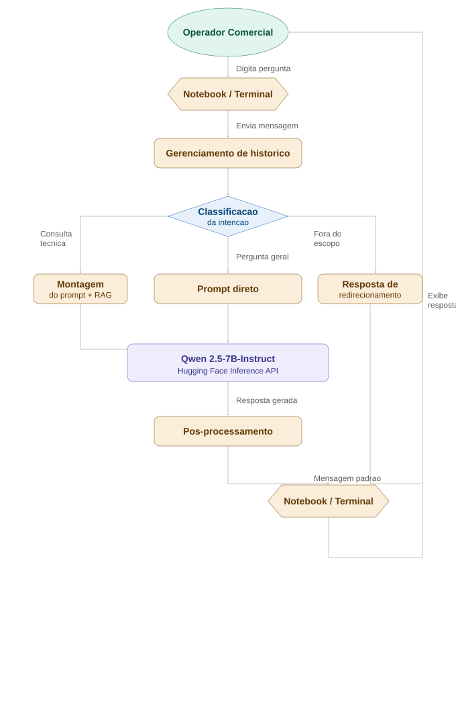

# Fluxograma de Funcionamento — Chatbot GoodWe

## Diagrama

## Descricao das Etapas

**1. Operador Comercial** — digita a pergunta no Notebook ou Terminal.

**2. Notebook / Terminal** — captura a mensagem e envia para processamento.

**3. Gerenciamento de historico** — mantém as ultimas 10 mensagens em memoria (janela deslizante) para garantir contexto nas respostas.

**4. Classificacao da intencao** — bifurcacao principal:
- **Consulta tecnica** → Montagem do prompt com RAG
- **Pergunta geral** → Prompt direto ao LLM
- **Fora do escopo** → Resposta de redirecionamento (nao aciona o LLM)

**5. Qwen 2.5-7B-Instruct (Hugging Face)** — recebe o prompt completo (system prompt + historico + mensagem) e gera a resposta.

**6. Pos-processamento** — formata a resposta e exibe no Notebook / Terminal.

## Historico de Troca de Modelo

| Modelo | Status | Motivo |
|--------|--------|--------|
| Google Gemini 2.0 Flash | Descartado | Cota gratuita esgotada (erro 429) |
| Mistral-7B-Instruct-v0.3 | Descartado | Descontinuado no endpoint de chat do HF |
| HuggingFaceH4/zephyr-7b-beta | Descartado | Sem suporte no plano free tier |
| **Qwen/Qwen2.5-7B-Instruct** | **Adotado** | Compativel com chat no free tier, boa qualidade em PT-BR |
