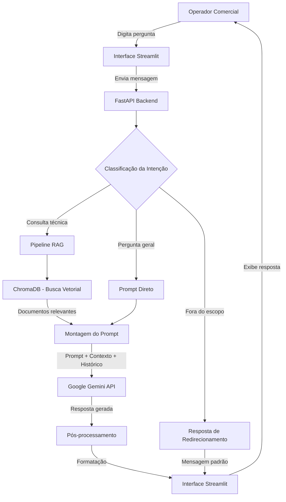

# Fluxograma de Funcionamento — Chatbot GoodWe

## Visão Geral

Este documento mostra como o chatbot Chatbot GoodWe funciona, desde a pergunta do operador até a resposta final. O sistema usa RAG (Retrieval-Augmented Generation) para buscar informações nos documentos técnicos antes de gerar a resposta.

---

## Fluxograma

---

## Descrição das Etapas

### 1. Entrada do Usuário

O operador comercial digita uma pergunta em linguagem natural na interface de chat (Streamlit), acessível pelo navegador.

Exemplo: _"Qual o status atual do eletroposto FIAP-01?"_

### 2. Interface Streamlit

A interface captura a mensagem, mantém o histórico da conversa e envia para o backend via requisição HTTP.

### 3. FastAPI Backend

O backend recebe a mensagem, gerencia o histórico de conversas e orquestra o processamento.

### 4. Classificação da Intenção

O sistema classifica a pergunta em três categorias:

| Categoria | Exemplo | O que acontece |
|-----------|---------|----------------|
| Consulta técnica | "Como configurar o OCPP 1.6?" | Passa pelo RAG para buscar nos documentos |
| Pergunta geral | "Boas práticas de operação?" | Vai direto pro LLM |
| Fora do escopo | "Qual o placar do jogo?" | Retorna mensagem padrão |

### 5. Pipeline RAG

Quando a pergunta é técnica, o sistema:

1. Transforma a pergunta em um embedding (representação vetorial)
2. Busca no ChromaDB os trechos de documentos mais parecidos com a pergunta
3. Monta o prompt final juntando: system prompt + trechos encontrados + histórico da conversa + pergunta do usuário

O ChromaDB vai armazenar manuais técnicos, guias operacionais e documentos do projeto GoodWe que vamos indexar na Sprint 2.

### 6. Google Gemini API

O modelo recebe o prompt completo e gera a resposta. Vamos usar o Gemini 2.0 Flash, que tem um plano gratuito bom o suficiente para o projeto.

### 7. Pós-processamento e Resposta

Após receber a resposta do Gemini, o sistema formata em Markdown e exibe na interface para o operador.
